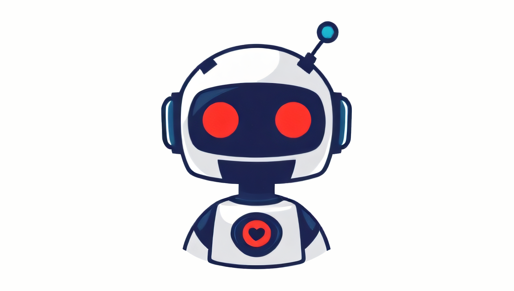

# Chatbot



Updated November 25, 2024

Simon Dietz

Conversational systems, also known as chatbots, are increasingly used in various domains like e-commerce and customer service to enable direct communication between businesses and users [1][10]. These systems offer a natural language interface, making them accessible to non-technical users. While chatbot platforms are becoming more prevalent, building them remains a technically demanding task [1]. 

## Terminology

When delving into the world of chatbots, we encounter a vast array of technical terms [3]. While it's not necessary to know every single term to grasp the fundamental concept of a chatbot [3], understanding key terms can significantly enhance your knowledge of conversational systems and artificial intelligence. As a non-technical user, a basic understanding is often sufficient. However, for my chatbot project, I aim to build a comprehensive vocabulary to achieve my learning goals.

In this document, I will compile a glossary of terms relevant to this topic that I come across during my research.

**Terms**
* **Chatbot:** A computer program designed to simulate conversation with a human user.
* **Conversational System:** A system that enables natural language interaction between humans and computers.
* **Chatbot training:** The process of teaching a chatbot to understand and respond to user input.
* **Training:** The process of feeding a machine learning model with data to improve its performance.
* **Training Data:** A dataset used to train a machine learning model, typically consisting of input data and corresponding output labels.
* **Utterance:** A specific statement or phrase uttered by a user.
* **Intent:** The user's goal or purpose behind a specific utterance.
* **Intent Recognition:** The process of identifying the user's goal or purpose from their input.
* **Entity:** A specific piece of information within a user's utterance, such as a name, location, or date.
* **Trigger:** A specific word or phrase that can initiate a chatbot's response.
* **Action:** A specific task or operation that a chatbot can perform, such as providing information, making a recommendation, or completing a transaction.
* **Condition:** A specific circumstance or requirement that must be met before a certain action can be taken.
* **Intent Listener:** A component of a chatbot that listens for specific intents in user input.
* **Natural Language (NL):**  Human language, such as English, Spanish, or Chinese.
* **Natural Language Interface:** A user interface that allows users to interact with a computer system using natural language.
* **Natural Language Processing (NLP):** A field of computer science and artificial intelligence concerned with the interaction between computers and human (natural) languages.
* **Dialog Management:** The process of managing the flow of a conversation, including tracking the conversation's state, identifying user intents, and selecting appropriate responses.
* **Machine Learning:** A field of artificial intelligence that gives computers the ability to learn without being explicitly programmed.
* **Reinforcement Learning: (RL)** A type of machine learning where an agent learns to make decisions by interacting with an environment [6] and receiving rewards or penalties [5].
* **Reinforcement Learning from Human Feedback (RLHF):**
* **User Query:** A specific question or request made by a user to a chatbot.
* **Artificial Intelligence (AI):** Artificial intelligence (AI) is a branch of computer science that aims to create intelligent agents, systems that can reason, learn, and act autonomously. AI systems are designed to mimic human cognitive functions, such as perception, reasoning, learning, and problem-solving [11].
* **Model:** A mathematical representation of a real-world system or process. In the context of chatbots, models are used to process user input and generate responses.
* **Human-in-the-loop (HITL)** Human in the Loop (HITL) is a collaborative approach in machine learning that integrates human expertise into the development and operation of AI systems. Humans actively participate in training, evaluating, and using these systems, providing valuable feedback and guidance [8][9].
*  **Exact Mathching (Direct Matching)** A simple approach to chatbot design where user input is **exactly matched** to a predefined response. This method relies on a database of pre-defined questions and answers. While efficient for straightforward queries, it lacks the flexibility to handle complex or nuanced user inputs.

## Chatbots: A Complex Interplay of Models

Chatbots are far more sophisticated than simple question-answer systems. They often rely on a combination of models to create natural and helpful conversations.
While chatbots can be complex, we can break down the core concept into a simplified representation to understand their basic functionality.

A typical chatbot involves:

* **User:** The user sends a message to the chatbot.
* **Intent Recognition:** The chatbot's intent recognition system analyzes the message to determine the user's intent (e.g., greeting, asking a question, making a request).
* **Response Generation:** Based on the recognized intent, the response generation system selects or generates an appropriate response.
* **User:** The chatbot sends the generated response back to the user.

This simplified model highlights the fundamental components of a chatbot, providing a solid foundation for further exploration.

```
classDiagram
    class User
        - Sends message
    class Intent Recognition
        - Receives message
        - Recognizes intent
    class Response Generation
        - Receives intent
        - Generates response
    class User << (User) >>
    class Intent Recognition << (System) >>
    class Response Generation << (System) >>
    User "Sends message" --> Intent Recognition
    Intent Recognition "Recognizes intent" --> Response Generation
    Response Generation "Generates response" --> User
```

**Note:** This is a simplified model. Real-world chatbots often involve more complex components and techniques, such as:

* **Natural Language Processing (NLP):** To understand the nuances of human language and extract relevant information.
* **Dialog Management:** To manage the flow of the conversation and track the context.
* **Machine Learning:** To train models for intent recognition, entity extraction, and response generation.

## Chatbot Classification

Chatbots can be classified based on their complexity, capabilities, and underlying technology [7]. Here are some common classifications: 

* **Rule-Based Chatbots**
* **AI-Powered Chatbots**

## Core Concepts and Functionalities:

**Intent Recognition:**
* Machine learning is used to determine the purpose or goal behind a user's query.
* Training data pairs user utterances with corresponding intents (e.g., "Hello there!" -> "Greeting"). The amount of training data needed depends on the model's complexity.

**Response Generation:**

Responses are often selected from a pre-defined set rather than generated entirely by the model.
While models like GPT-3.5 and GPT-4 can generate highly sophisticated text, simpler rule-based or template-based approaches suffice for many applications.

**Reinforcement Learning:**
* In addition to supervised learning for intent recognition, models like ChatGPT employ reinforcement learning.
* The model is rewarded or penalized based on human feedback, improving the quality of generated responses over time.

**Key Considerations:**
* Model Diversity: Chatbots can have various architectures, tailored to specific use cases and available resources.
* Training Data: The quality and quantity of training data significantly impact chatbot performance.
* Human Involvement: Even advanced models often require human intervention, such as creating training data or crafting responses.

## Training a Simple Chatbot

**Training Data**

A fundamental step in creating a chatbot is providing it with training data. This data consists of pairs of user utterances and their corresponding intents. By training a machine learning model on this data, the chatbot can learn to recognize user intents and provide appropriate responses.

Here's a simple example of training data:

| Text | Intent |
|---|---|
| Hi, how are you? | Greeting |
| Hello, what can I do for you? | Greeting |
| I need help | Help |
| I have a problem | Help |
| Can you help me with this? | Help |
| What is the weather today? | Weather |
| Tell me the weather forecast | Weather |

**How a Chatbot Processes Training Data**

**Direct Match**

When a chatbot is trained on a dataset like the one provided, it typically involves advanced machine learning techniques [12]. However, for simpler rule-based chatbots, a straightforward approach is to use predefined responses linked to specific user utterances or their variations. This method is particularly effective for chatbots with a large database of predefined responses. This concept is often referred to as **exact match** or **direct match**. Although this method demands a substantial, well-curated dataset, it provides a rapid solution for deploying a simple chatbot without the need for complex algorithms and infrastructure. In particular, FAQ agents can benefit greatly from this approach. If a company has a substantial dataset of real user queries and well-prepared support answers, building a rule-based chatbot becomes significantly easier. Direct matching is particularly effective for short, concise queries like "address," "opening hours," or a product name. By directly linking these keywords to specific responses, we can provide users with the desired information quickly and easily.

**How does it work?**

1. **Hash Function:** Every user query is converted into a unique hash value.
2. **Database Lookup:** This hash value is used to search a database of predefined responses.
3. **Direct Response:** If an exact match is found, the corresponding response is returned.

**Metadata**

The direct match approach provides a solid foundation for building a simple chatbot. However, before you start storing a multitude of hashes in a database, consider enriching the simple utterance-intent pairs with metadata. For instance, you could capture the **formality** of the query (**formal** or **informal**). Additionally, combined intents should be considered. In the query "Hello, how are you? I need help finding a product," for example, there are multiple intents. Here, the question arises as to which intent is more relevant to the user – probably the product search. A match counter could also be useful to track the frequency of certain queries.

**Why Metadata Matters**

By adding metadata to your training data, you can provide your chatbot with more context and nuance. This can help it to:

* **Handle Complex Queries:** Understand and respond to more complex user queries.
* **Identify Intent Prioritization:** Determine the primary intent when multiple intents are present in a single query.
* **Track User Behavior:** Analyze user interactions and identify trends.
* **Personalize Responses:** Tailor responses based on user preferences or past interactions.
   
**Note:** While exact matching is a straightforward approach, it has limitations. It can struggle with variations in phrasing and may not handle complex queries effectively. More advanced chatbots often combine exact matching with techniques like natural language processing and machine learning to improve their capabilities.

## Entities

Entities are essentially labeled categories or types of information that are relevant within a user's query. These can be concrete things like product names, locations, dates, or numbers, or more abstract concepts like colors or emotions.

## Behavior Trees and Chatbots

During my initial research on chatbots, I encountered terminology similar to that used in behavior trees. Actions and conditions are fundamental components of a behavior tree. My first encounter with behavior trees was over 15 years ago, when they were not as widely used as they are today. Behavior trees are now a staple of major game engines and a well-established concept. I am curious about how I can apply this AI concept to a chatbot to assist it in performing actions. Specifically, I want to evaluate whether a combination of behavior trees and intent-based chatbots is feasible and what possibilities it offers.

## Behavior Trees and Chatbots: A Deeper Dive

Behavior trees are a powerful technique for structuring AI agents, including chatbots. They offer a hierarchical and modular approach to decision-making and action selection. By applying behavior trees to chatbot development, we can create more complex and intelligent conversational agents.

**How Behavior Trees Can Enhance Chatbots**

* **Modular Design:** Behavior trees break down complex behaviors into smaller, manageable nodes, making the chatbot's logic more organized and easier to maintain.
* **Hierarchical Structure:** This structure allows for a clear representation of the chatbot's decision-making process, from high-level goals to specific actions.
* **Flexibility:** Behavior trees can be easily adapted to new situations and requirements by modifying or adding new nodes.
* **Parallelism:** Behavior trees can handle multiple tasks simultaneously, enabling the chatbot to perform multiple actions in parallel.

## Additional Considerations for this document:

* **Chatbot Applications:** Customer support, e-commerce, education, etc.
* **Challenges:** Handling ambiguous language, unexpected inputs, and ensuring privacy.
* **Future Trends:** Integration of multimodal data (text, image, audio) and improved contextual understanding.

# References
* [1] https://link.springer.com/chapter/10.1007/978-3-030-49418-6_17 11-25-2024
* [2] https://www.moin.ai/chatbot-lexikon/chatbot-trainieren-trainingsdaten-ki (German) 11-25-2024
* [3] https://www.tidio.com/blog/training-a-chatbot/ 11-25-2024
* [4] https://capacity.com/learn/ai-chatbots/how-to-train-a-chatbot/ 11-25-2024
* [5] https://www.quincus.com/blog/the-power-of-automation-in-logistics/ 11-25-2024
* [6] https://blog.finxter.com/openai-glossary/ 11-25-2024
* [7] https://www.ibm.com/think/topics/chatbot-types 11-25-2024
* [8] https://cloud.google.com/discover/human-in-the-loop 11-25-2024
* [9] https://medium.com/vsinghbisen/what-is-human-in-the-loop-machine-learning-why-how-used-in-ai-60c7b44eb2c0 11-25-2024
* [10] https://masterofcode.com/blog/chatbot-statistics 11-25-2024
* [11] https://www.ibm.com/topics/artificial-intelligence 11-25-2024
* [12] https://mitsloan.mit.edu/ideas-made-to-matter/machine-learning-explained#:~:text=Machine%20learning%20is%20behind%20chatbots,your%20social%20media%20feeds%20are 11-25-2024

banner image created with deep ai https://deepai.org 10-25-2024
